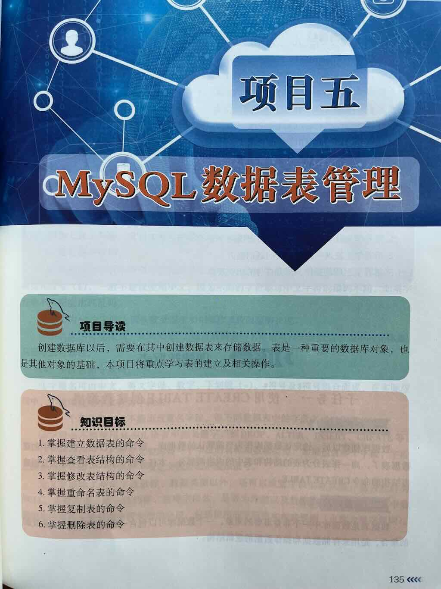
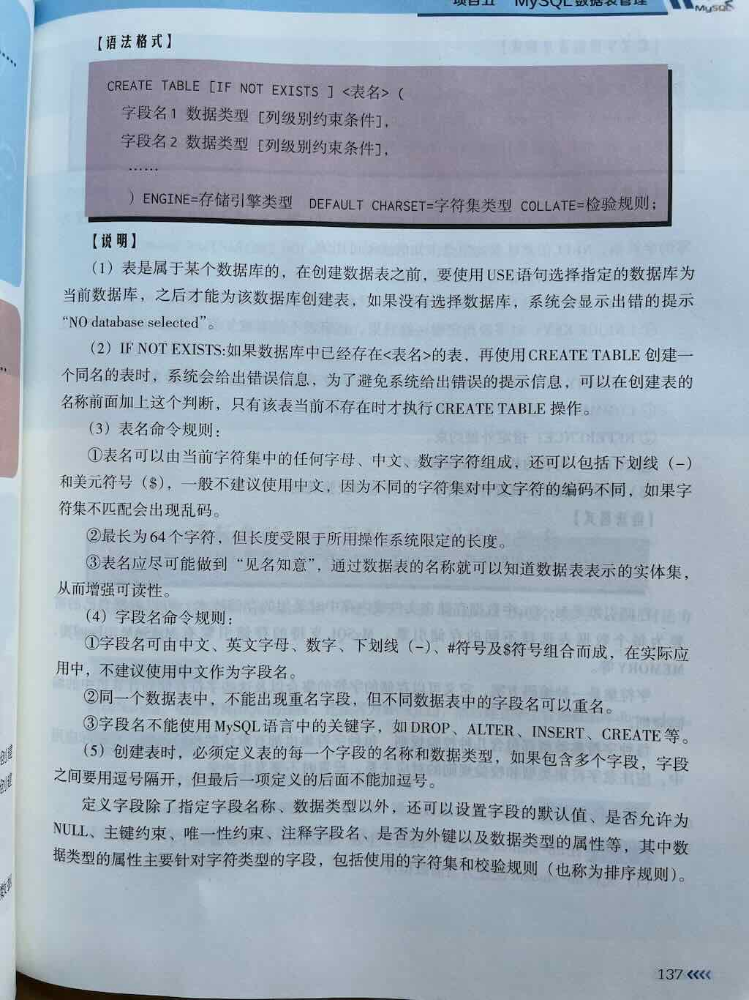
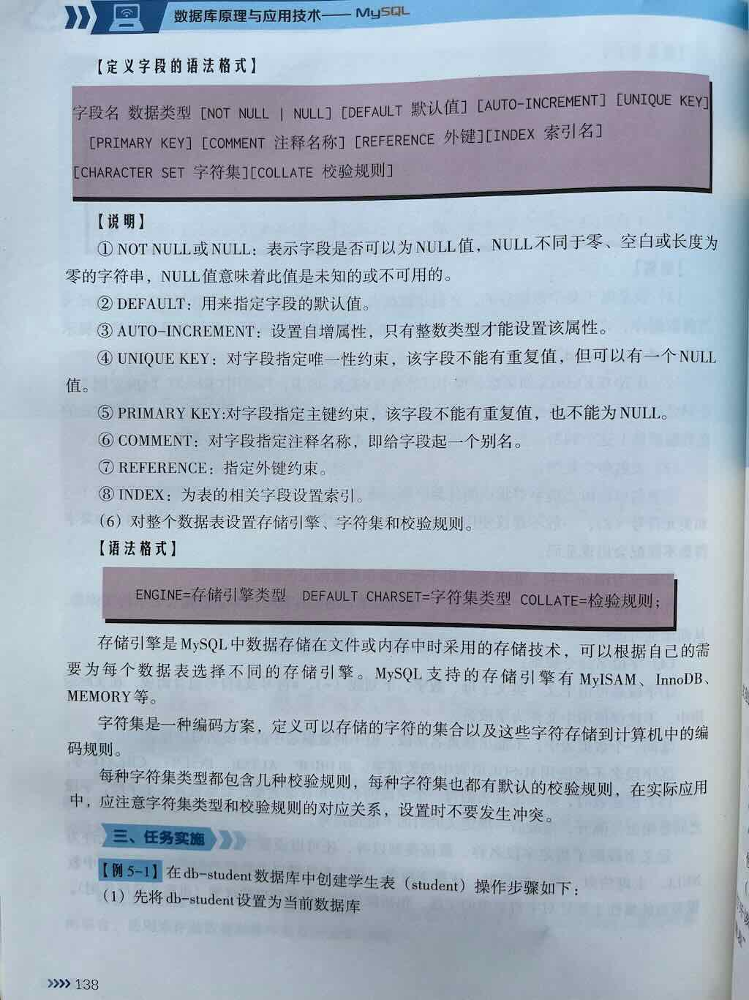
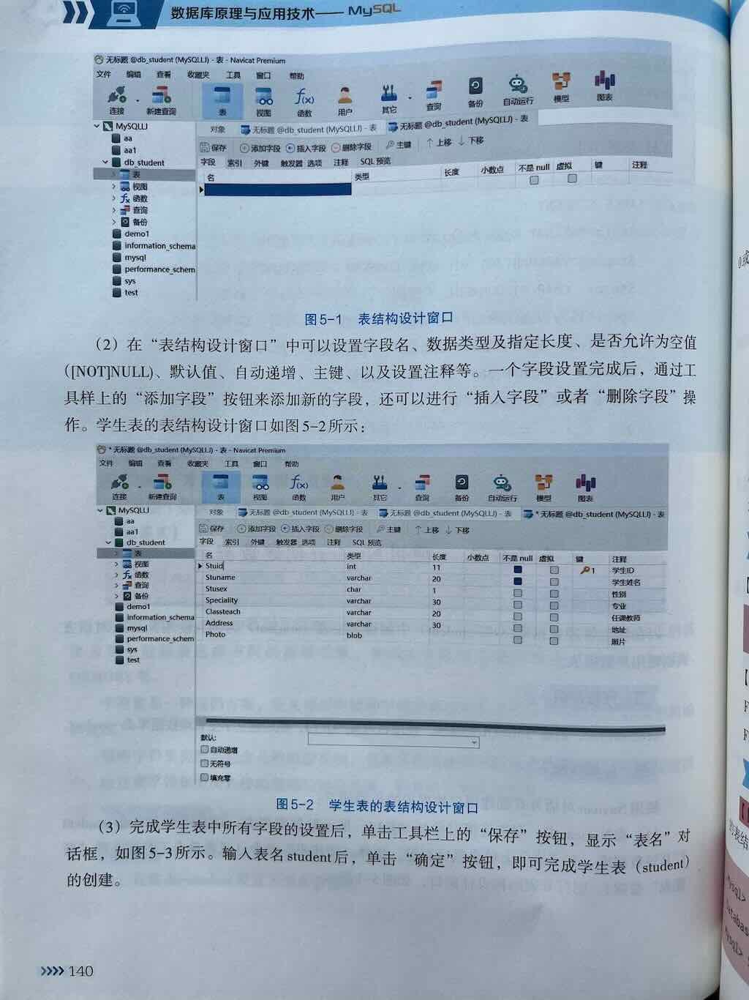

 
 
 
 
 
 
 


## 数据库的构成

在创建数据库表之前，你首先要清楚数据库的构成，MySQL的数据结构：

- 数据库：由多个表组成。
- 表：多条记录构成了一个表。一个表包含多条记录。
- 列：包括字段和值。
- 记录：一条记录包括多个项目的值。

## 数据库表的形式

一个数据库由一个或多个表组成。表的形式如下：

| id   | 姓名(name) | 年龄(age) | 性别(gender) | 入学日期(the_date) |
| ---- | ---------- | --------- | ------------ | ------------------ |
| 1    | 张三       | 16        | 男           | 2024-09-01         |
| 2    | 李四       | 17        | 女           | 2024-09-01         |
| 3    | 王五       | 16        | 男           | 2024-08-31         |


定义

表是以行和列的形式存储数据。创建表就是定义列的过程。一个列分为三部分：

- 列名
- 数据类型
- 约束条件

## 创建数据表的语法

```sql
列名1 数据类型 [约束条件],
列名2 数据类型 [约束条件]
```

说明：

- 列名：建议小写，不能以数字开头
- 数据类型：用来存储不同类型的数据。比如：字符串、整数、日期
- 约束条件：用来对存储的数据进行约束。比如：不能为空、必须唯一等

语法

```sql
CREATE TABLE 表名 (
	列名1 数据类型 [约束条件],
    列名2 数据类型 [约束条件],
    列名3 数据类型 [约束条件]
);
```

示例

```sql
CREATE TABLE student(
    id INT AUTO_INCREMENT PRIMARY KEY,
    name VARCHAR(20) NOT NULL,
    age INT,
    gender ENUM('男','女'),
    the_date DATE
);
```

说明

|`INT`|示整数类型，用于创建整数存储。|
|---|---|
|`VARCHAR(20)`| 表示变长字符串类型，用于创建字符串存储。|
|`ENUM('男','女')` |表示字符串值列表，用于创建字符串存储。|
|`DATE`| 表示日期类型，用于创建日期存储。|
|`PRIMARY KEY`|   主键，用于标识一行，具有唯一性。|
|`AUTO_INCREMENT` |自动增长，约束整数类型自动递增，无需再手动输入。|
|`NOT NULL`|非空，不允许填写空值。|

注意事项：

1. 数据库名、表名、列名全部建议小写，并且不能以数字开头。
2. 所有的SQL语句建议大写。
3. 所有标点符号必须是英文输入法下的符号。如：圆括号`()`、逗号`,`、分号`;`

## **MySQL 定义表的基本语法**

```sql
CREATE TABLE [IF NOT EXISTS] 表名 (
    -- 列定义
    列1 数据类型 [列约束],
    列2 数据类型 [列约束],
    
    -- 表级约束
    [PRIMARY KEY (列名)],
    [FOREIGN KEY (外键列) REFERENCES 父表(父表列)],
    [UNIQUE (列名)],
    [CHECK (条件表达式)]
)
[ENGINE=存储引擎]
[DEFAULT CHARSET=字符集]
[COMMENT='表注释']
[其他表选项];
```
## 创建表的完整过程

```sql
-- 创建数据库
CREATE DATABASE 数据库名;

-- 创建表语法
CREATE TABLE 表名 (
	  列名1 数据类型 [约束条件],
    列名2 数据类型 [约束条件],
    列名3 数据类型 [约束条件]
);

-- 设置默认值
CREATE TABLE 表名 (
    列名 数据类型 DEFAULT 默认值,
    ...
);
CREATE TABLE users (
    id INT AUTO_INCREMENT PRIMARY KEY,
    username VARCHAR(50) NOT NULL DEFAULT 'guest',
    created_at TIMESTAMP DEFAULT CURRENT_TIMESTAMP
);
```

## 操作数据结构

操作数据库，就是指操作数据结构和数据。

- 数据结构：组织数据的方式
- 数据：就是记录。一个记录由多个项目构成，一个记录就是一条数据。

关键词

1. 创建数据结构：CREATE
2. 修改数据结构：ALTER
3. 删除数据结构：DROP
4. 查询数据结构：SHOW
