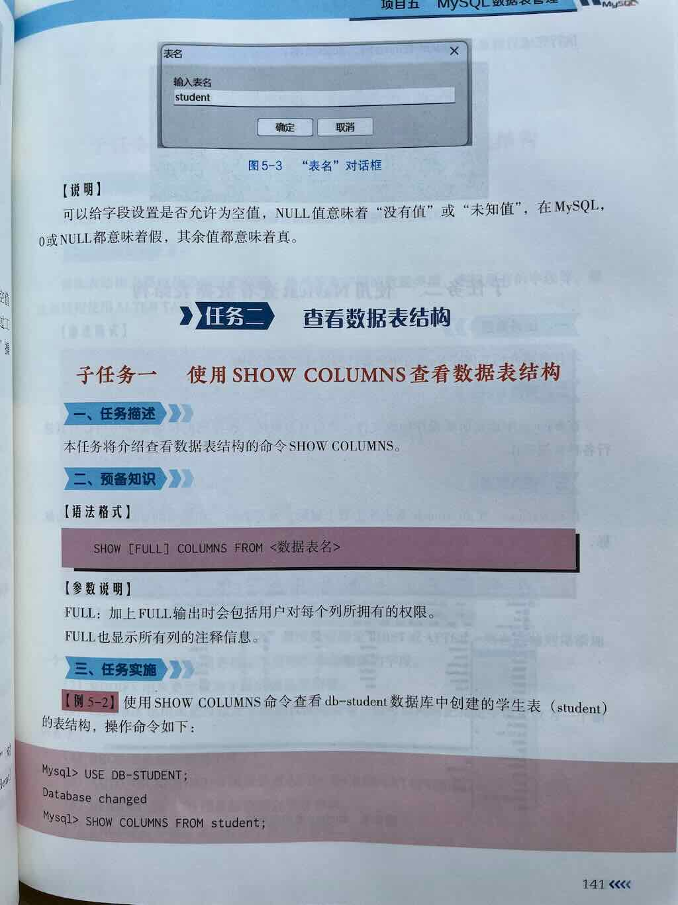
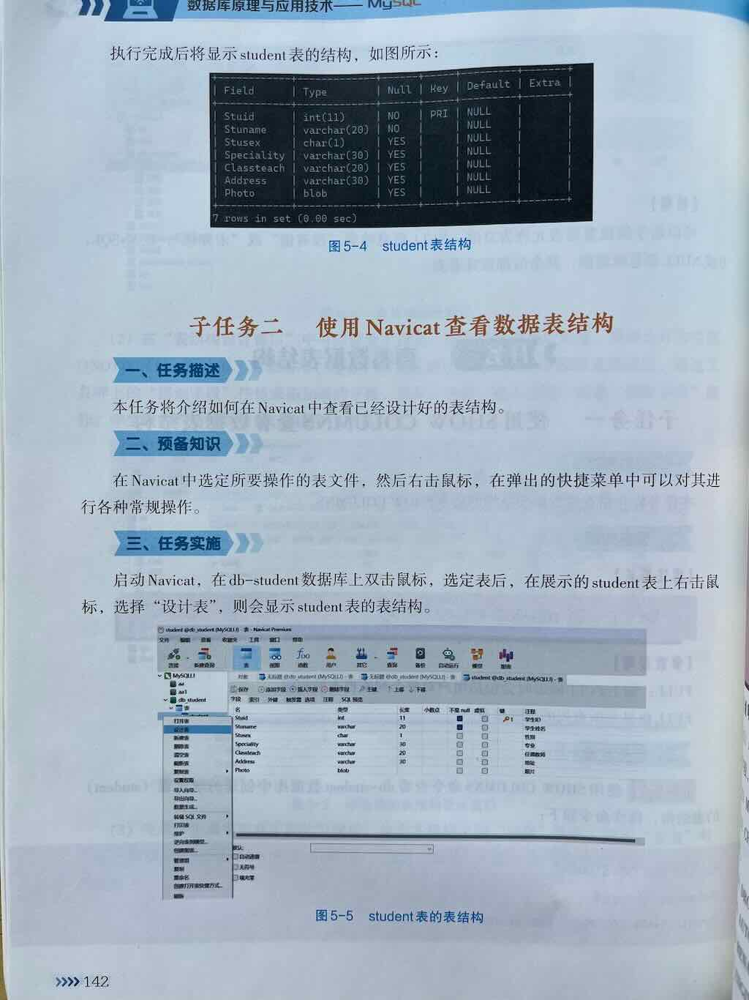

 
 
 


创建表之后，如果想查看表名或表结构，可以这样操作：

语法

```sql
-- 查看表名
SHOW TABLES;
-- 查询指定数据库中表
SHOW TABLES FROM 数据库名;
-- 查看表结构(指定表中的列)
SHOW COLUMNS FROM student;
```

示例: 

```sql
-- 查看表名
SHOW TABLES;
-- 查询指定数据库中表
SHOW TABLES FROM student_db;
-- 查看表结构(指定表中的列)
SHOW COLUMNS FROM student;
```


