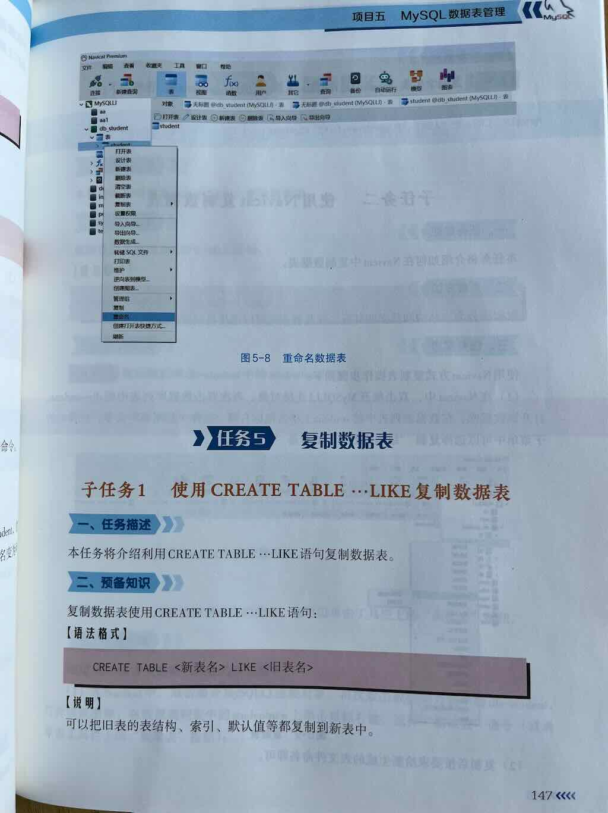
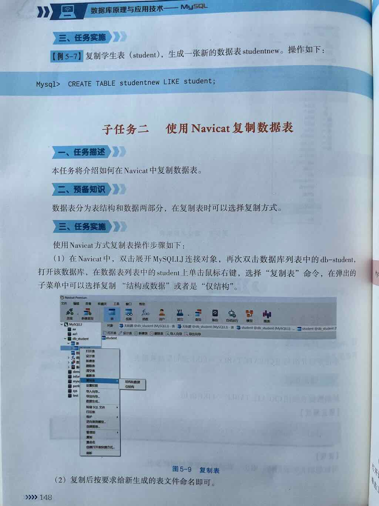

 
 

在MySQL中，有几种方法可以只复制表的结构而不复制表中的数据。以下是主要的几种方法：

## 方法1：CREATE TABLE LIKE(推荐)

这是最直接和清晰的方法，只复制表结构（包括索引、约束等），不复制数据。

```sql
CREATE TABLE 新表名 LIKE 原表名;
```

特点：

- 只复制表结构，不复制数据
- 复制所有索引、主键、外键、唯一约束等
- 不复制表中的数据
- 不复制表中的触发器（MySQL 8.0之前）
- 新表与原表在不同的文件中（对于MyISAM）

示例：
```sql
-- 复制employees表的结构到employees_copy
CREATE TABLE employees_copy LIKE employees;
```

## 方法2：CREATE TABLE  SELECT

这种方法可以更灵活地选择要复制的列，但默认不会复制索引、主键等约束。

```sql
CREATE TABLE 新表名 AS 
SELECT * FROM 原表名 
WHERE 1=0;  -- 条件永远为假，不复制任何数据
```

特点：

- 只复制表结构（列定义），不复制数据
- 不复制索引、主键、外键、唯一约束等
- 可以通过SELECT语句选择特定的列（但使用WHERE 1=0时通常复制所有列）
- 简单直接

示例：
```sql
-- 复制employees表的结构（不包含索引等约束）到employees_structure
CREATE TABLE employees_structure AS 
SELECT * FROM employees 
WHERE 1=0;
```

## 方法3：结合使用

复制结构+特定修改：如果需要复制结构并进行一些修改，可以结合使用：

```sql
CREATE TABLE 新表名 LIKE 原表名;
-- 然后可以添加ALTER TABLE语句进行修改
ALTER TABLE 新表名 ADD COLUMN 新列名 数据类型;
```

## 各方法对比

| 方法 | 复制结构 | 复制数据 | 复制索引/约束 | 复制触发器 | 备注 |
|------|---------|---------|--------------|-----------|------|
| CREATE TABLE ... LIKE | 是 | 否 | 是 | MySQL 8.0前否，8.0后是 | 最完整复制表结构 |
| CREATE TABLE ... SELECT WHERE 1=0 | 是（列定义） | 否 | 否 | 否 | 最简单，但约束不完整 |
| 导出/导入DDL | 是 | 否 | 是 | 是 | 通过SHOW CREATE TABLE获取DDL |


## 注意事项

1. **权限要求**：执行这些操作需要对新表有创建权限，对原表有选择权限
2. **存储引擎**：新表将使用默认存储引擎，除非特别指定
3. **表选项**：`CREATE TABLE ... LIKE`会复制原表的存储引擎、字符集等选项
4. **外键约束**：复制外键约束时要注意引用完整性
5. **自增列**：自增列的当前值不会被复制

## 总结

对于大多数情况，**`CREATE TABLE 新表名 LIKE 原表名;`** 是最推荐的方法，因为它完整复制了表结构，包括索引、约束等，而且语法清晰明确。

如果只需要简单的列结构而不关心索引等约束，可以使用 **`CREATE TABLE 新表名 AS SELECT * FROM 原表名 WHERE 1=0;`** 方法。

根据具体需求选择最适合的方法，考虑是否需要复制索引、约束、触发器等元素。


