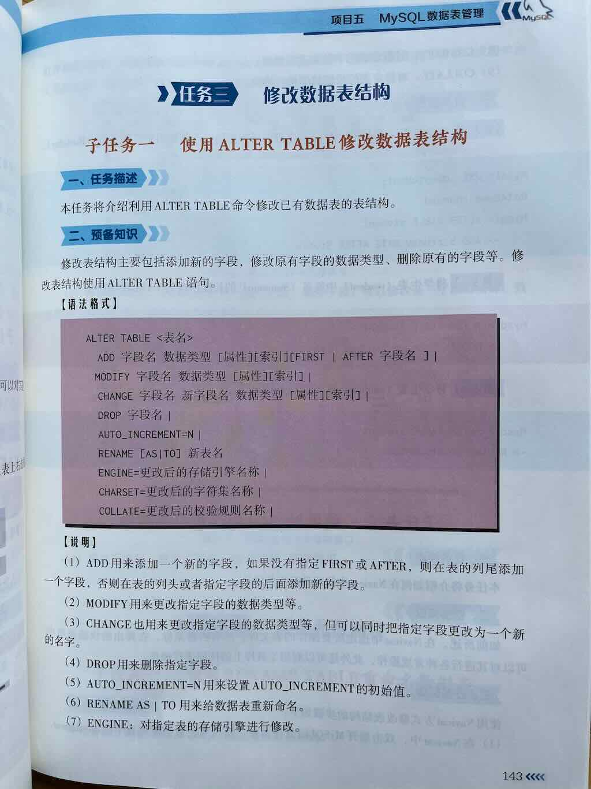
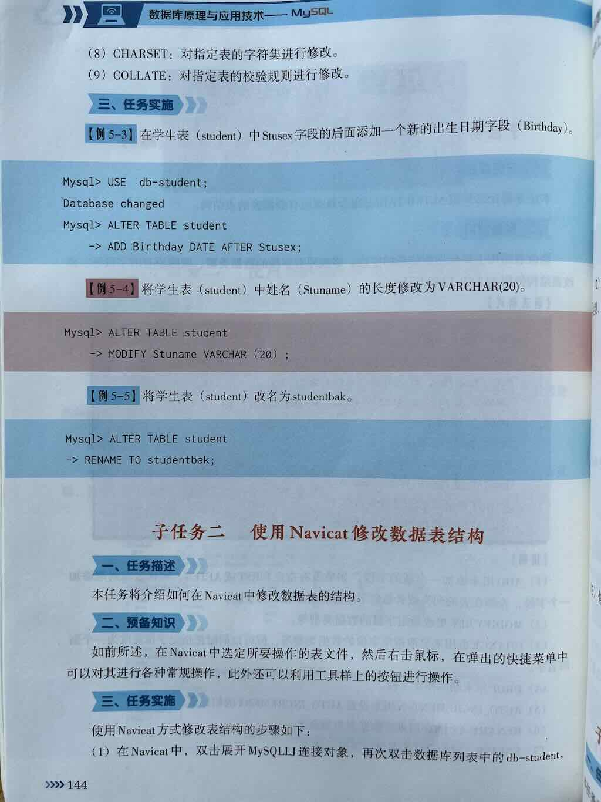
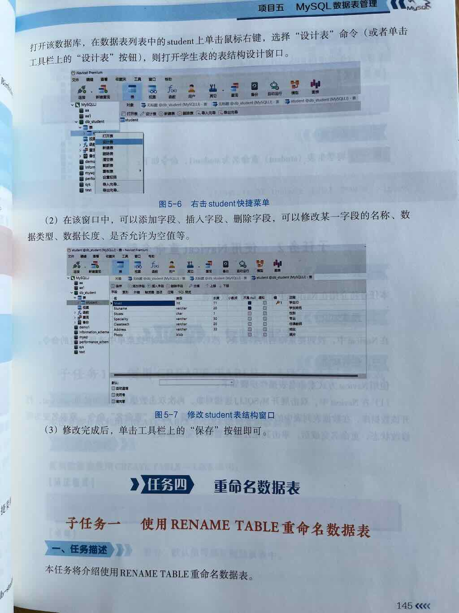
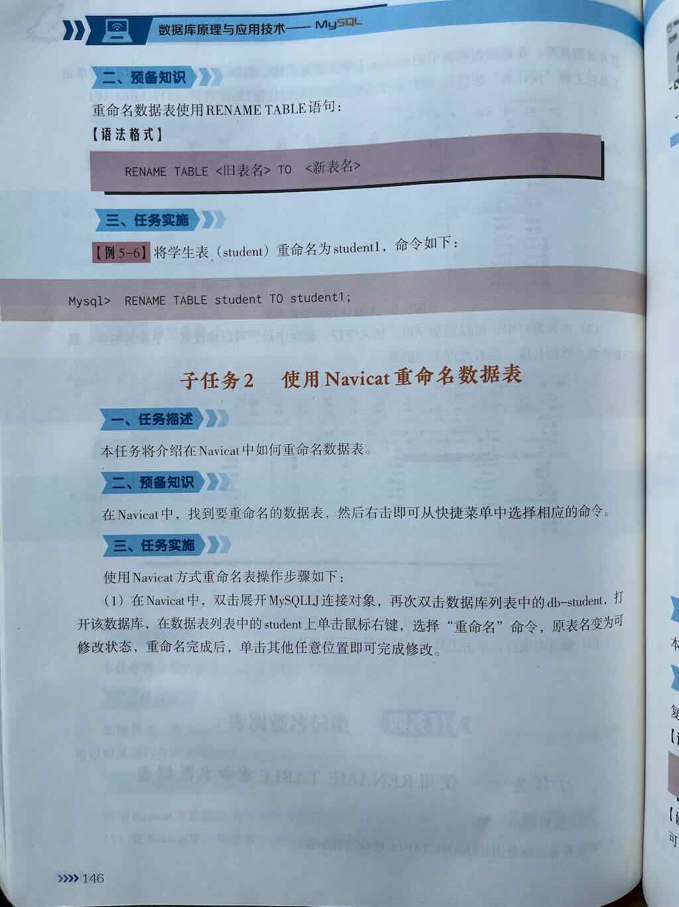
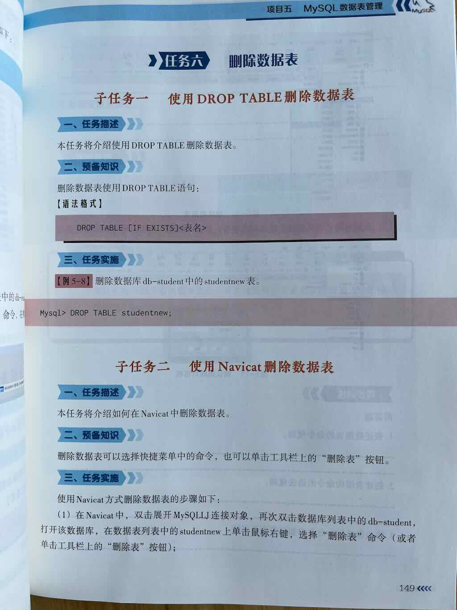
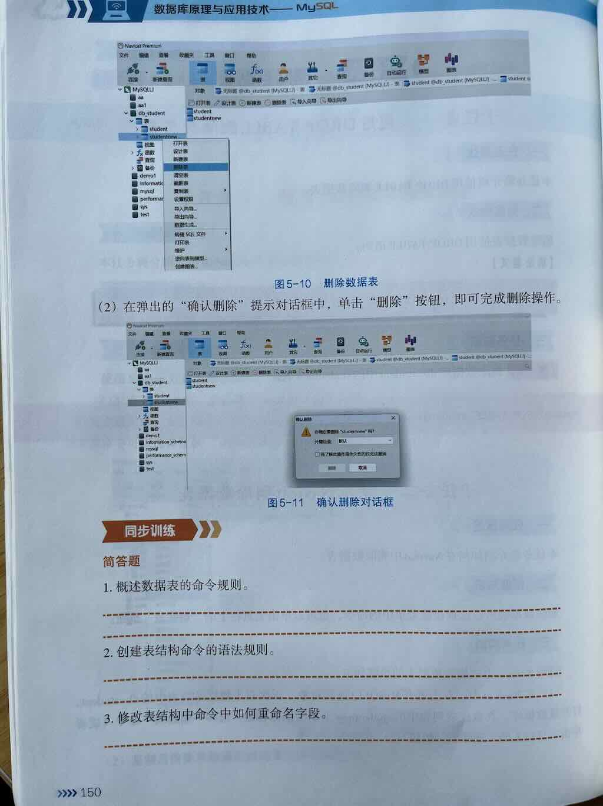
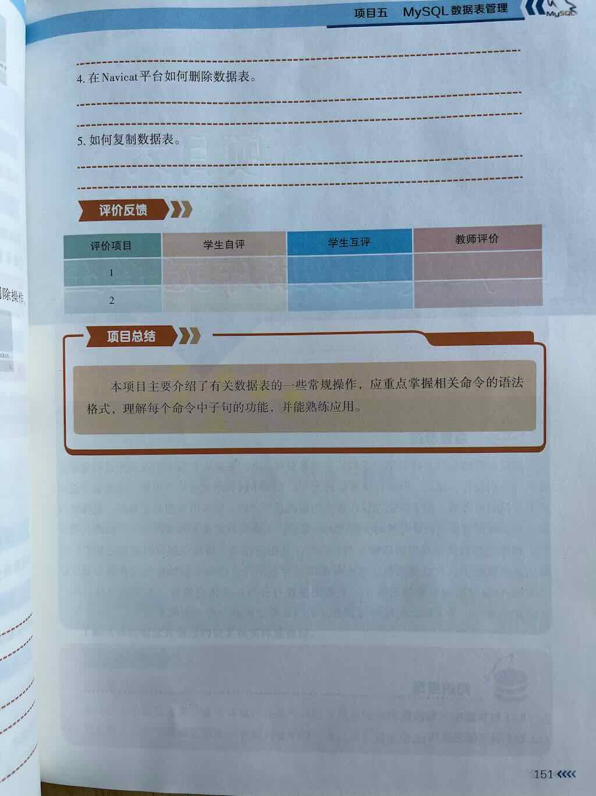

在 MySQL 的数据定义语言(DDL)中，修改数据表(ALTER TABLE)主要包括对数据表的**结构**进行各种变更。主要包括：

1. 修改列
2. 修改约束条件
3. 修改索引
4. 修改表选项
5. 修改注释


 
 
 
 
 
 
 
 
 


## 一、修改表结构的主要操作类型

### 1. 添加列（字段）
向现有表中添加新的列/字段
```sql
ALTER TABLE 表名 ADD [COLUMN] 列名 数据类型 [约束条件] [FIRST|AFTER 现有列名];
```

### 2. 修改列（字段）
更改现有列的数据类型、名称或约束
```sql
-- 修改列的数据类型和属性
ALTER TABLE 表名 MODIFY [COLUMN] 列名 新数据类型 [约束条件];

-- 修改列名和数据类型
ALTER TABLE 表名 CHANGE [COLUMN] 原列名 新列名 新数据类型 [约束条件];
```

### 3. 删除列（字段）
从表中移除不再需要的列
```sql
ALTER TABLE 表名 DROP [COLUMN] 列名;
```

### 4. 修改表名
重命名表
```sql
ALTER TABLE 原表名 RENAME [TO|AS] 新表名;
-- 或者
RENAME TABLE 原表名 TO 新表名;
```

## 二、修改表约束

### 1. 添加主键
```sql
ALTER TABLE 表名 ADD PRIMARY KEY (列名);
```

### 2. 删除主键
```sql
ALTER TABLE 表名 DROP PRIMARY KEY;
```

### 3. 添加唯一约束
```sql
ALTER TABLE 表名 ADD UNIQUE (列名);
-- 或者带约束名称
ALTER TABLE 表名 ADD CONSTRAINT 约束名 UNIQUE (列名);
```

### 4. 删除唯一约束
```sql
ALTER TABLE 表名 DROP INDEX 约束名;
```

### 5. 添加外键
```sql
ALTER TABLE 子表名 ADD FOREIGN KEY (子表列名) REFERENCES 父表名(父表列名);
```

### 6. 删除外键
```sql
ALTER TABLE 表名 DROP FOREIGN KEY 外键约束名;
```

### 7. 添加/删除检查约束

注意：MySQL 8.0.16+

```sql
-- 添加检查约束
ALTER TABLE 表名 ADD CONSTRAINT 约束名 CHECK (条件表达式);

-- 删除检查约束
ALTER TABLE 表名 DROP CONSTRAINT 约束名;
```

## 三、修改索引

### 1. 添加普通索引
```sql
ALTER TABLE 表名 ADD INDEX 索引名 (列名);
-- 或简写为
ALTER TABLE 表名 ADD INDEX (列名);
```

### 2. 添加唯一索引
```sql
ALTER TABLE 表名 ADD UNIQUE INDEX 索引名 (列名);
-- 或简写为
ALTER TABLE 表名 ADD UNIQUE (列名);
```

### 3. 添加全文索引

注意：MySQL 5.6+的InnoDB支持

```sql
ALTER TABLE 表名 ADD FULLTEXT INDEX 索引名 (列名);
```

### 4. 删除索引
```sql
ALTER TABLE 表名 DROP INDEX 索引名;
```

## 四、修改表选项

可以修改表的存储引擎、字符集等属性
```sql
ALTER TABLE 表名 ENGINE = 存储引擎类型;  -- 如 InnoDB, MyISAM
ALTER TABLE 表名 DEFAULT CHARSET = 字符集;  -- 如 utf8mb4
ALTER TABLE 表名 COLLATE = 排序规则;  -- 如 utf8mb4_unicode_ci
ALTER TABLE 表名 AUTO_INCREMENT = 值;  -- 修改自增起始值
```

## 五、修改表注释和列注释

### 1. 修改表注释
```sql
ALTER TABLE 表名 COMMENT '表注释内容';
```

### 2. 修改列注释
```sql
ALTER TABLE 表名 MODIFY [COLUMN] 列名 数据类型 COMMENT '列注释内容';
```

## 六、其他修改操作

### 1. 修改列的默认值
```sql
ALTER TABLE 表名 ALTER [COLUMN] 列名 SET DEFAULT 默认值;
-- 或者
ALTER TABLE 表名 MODIFY [COLUMN] 列名 数据类型 DEFAULT 默认值;
```

### 2. 删除列的默认值
```sql
ALTER TABLE 表名 ALTER [COLUMN] 列名 DROP DEFAULT;
```

### 3. 修改列的位置
```sql
ALTER TABLE 表名 MODIFY [COLUMN] 列名 数据类型 FIRST;
ALTER TABLE 表名 MODIFY [COLUMN] 列名 数据类型 AFTER 其他列名;
```

## 七、注意事项

1. **数据兼容性**：修改列的数据类型可能导致现有数据不兼容，需谨慎操作
2. **性能影响**：在大表上执行ALTER TABLE操作可能会锁表，影响生产环境
3. **外键约束**：修改有外键关联的表结构需要特别小心
4. **备份建议**：在执行重大表结构修改前，建议先备份数据
5. **在线DDL**：MySQL 5.6+支持部分在线DDL操作，减少锁表时间

## 总结

MySQL 的 ALTER TABLE 语句提供了强大的表结构修改能力，主要包括：
- **列操作**：添加、修改、删除列，修改列的数据类型和约束
- **约束操作**：管理主键、唯一键、外键和检查约束
- **索引操作**：添加和删除各种类型的索引
- **表属性**：修改存储引擎、字符集、自增值等表选项
- **注释**：修改表和列的注释信息

## ALTER TABLE常用操作速查

| 功能 | 语法示例 |
|------|----------|
| 添加列 | `ALTER TABLE 表名 ADD 列名 类型 [约束] [AFTER 列名]` |
| 修改列类型/属性 | `ALTER TABLE 表名 MODIFY 列名 新类型 [约束]` |
| 修改列名称和类型 | `ALTER TABLE 表名 CHANGE 旧列名 新列名 新类型 [约束]` |
| 删除列 | `ALTER TABLE 表名 DROP COLUMN 列名` |
| 添加主键 | `ALTER TABLE 表名 ADD PRIMARY KEY (列名)` |
| 删除主键 | `ALTER TABLE 表名 DROP PRIMARY KEY` |
| 重命名表 | `ALTER TABLE 旧表名 RENAME TO 新表名` 或 `RENAME TABLE 旧表名 TO 新表名` |

---